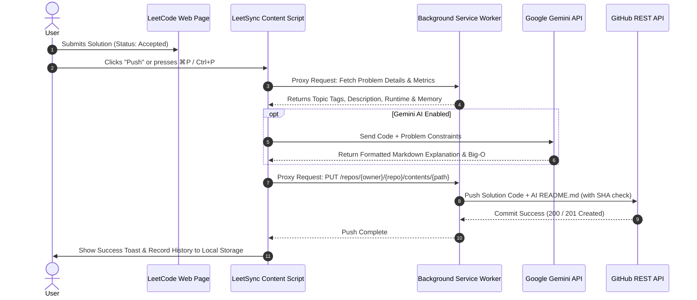

# 🚀 LeetSync Pro

<div align="center">


<p align="center">
  <b>Sync your LeetCode solutions to GitHub automatically with AI explanations, smart categorization, rich analytics dashboards, and daily challenge reminders.</b>
</p>

</div>

---

## ✨ Why LeetSync Pro?

Solving LeetCode problems is one of the best ways to prepare for technical interviews and sharpen your algorithmic skills. However, keeping your solutions organized, documenting your thought process, and maintaining a green GitHub contribution graph can be tedious and time-consuming.

**LeetSync Pro** bridges the gap by transforming your LeetCode workflow into an automated, AI-enhanced software engineering portfolio!

```
   ┌──────────────────┐         1-Click / ⌘P          ┌──────────────────┐
   │                  │ ────────────────────────────► │                  │
   │  LeetCode Page   │                               │  GitHub Repo     │
   │  (Accepted Code) │ ◄──────────────────────────── │  (Clean Folder & │
   │                  │    AI Explanations (Gemini)   │   AI README.md)  │
   └──────────────────┘                               └──────────────────┘
```

---

## 🌟 Key Features

### 🚀 1-Click & Keyboard GitHub Sync
* **Seamless Integration:** Injects a sleek **Push** button directly into the LeetCode IDE top bar and submission pages.
* **Keyboard Shortcuts:** Push instantly without lifting your hands from the keyboard using `⌘P` (macOS) or `Ctrl+P` (Windows/Linux).
* **Smart Extraction:** Built with a robust **3-Tier Code Extraction Engine** (LeetCode GraphQL API → Monaco Main World Editor → DOM Fallback) to guarantee accurate code capture across all supported programming languages.
* **Performance Metrics:** Automatically appends runtime speed (`ms`) and memory usage (`MB`) directly into your GitHub commit messages!

### 🤖 AI-Powered Solution READMEs (Google Gemini)
Never push bare code again! Connect your **Google Gemini API Key** to automatically generate comprehensive, professional Markdown documentation for every problem you solve:
* 📝 **Problem Description & Constraints:** Cleanly formatted markdown summary of the problem statement.
* 💡 **Core Intuition:** Highlights the fundamental insights and breakthroughs required to solve the problem.
* 🛠️ **Algorithm Approach:** Step-by-step walkthrough of the data structures and logic used in your solution.
* ⏳ **Complexity Analysis:** Detailed Big-$O$ Time and Space complexity explanations.

### 📂 Smart Topic Categorization
Instead of dumping hundreds of files into a flat directory, LeetSync Pro automatically organizes your solutions into clean, structured Data Structures & Algorithms (DSA) folders based on official problem tags:

```text
my-leetcode-solutions/
├── 01-Arrays-and-Hashing/
│   ├── 1-Two-Sum/
│   │   ├── solution.py
│   │   └── README.md         # 🤖 AI-Generated Explanation!
│   └── 217-Contains-Duplicate/
├── 05-Binary-Search/
│   └── 704-Binary-Search/
├── 07-Trees/
│   └── 226-Invert-Binary-Tree/
├── 10-Graphs/
│   └── 200-Number-of-Islands/
└── 20-Database/
```

### 📊 Built-in Analytics & Submission Dashboard
Open the extension popup to access a personal command center tracking your coding journey:
* 🔥 **Daily Streak Tracker:** Displays your current active day streak and total problems solved.
* 📈 **Activity Heatmap:** A visual, GitHub-style submission activity graph showing your consistency over time.
* 🎯 **Difficulty Breakdown:** Visual progress bars tracking your solved easy, medium, and hard challenges.
* 💻 **Language Breakdown:** See which programming languages (Python, C++, Java, Rust, SQL, etc.) you use most.
* 🕒 **Recent Submissions Feed:** Quick-access history of your latest pushes.

### 🔔 Daily Challenge Reminders & Live Badge
* **Never Break the Chain:** Schedule customizable daily notifications (e.g., 9:00 AM) reminding you of the active LeetCode Daily Coding Challenge. Click the notification to jump straight into the problem!
* **Dynamic Extension Badge:** Displays a satisfying green checkmark (`✓`) when today's daily challenge is completed, or an orange alert badge (`1`) when it is still pending.

### 🎯 Focus Mode (Hide Premium Clutter)
* **Distraction-Free Coding:** Toggle **Hide Premium Icons** in settings to cleanly remove LeetCode premium upsell badges, lock icons, and subscription prompts from problem lists and IDE tables.

---

## 🏗️ Architecture & Workflow



---

## 🚀 Installation & Setup

### 1️⃣ Install as Unpacked Extension (Developer Mode)
Since LeetSync Pro is a custom developer extension, you can install it directly into Chrome, Edge, Brave, or any Chromium-based browser:

1. Clone or download this repository to your local machine:
   ```bash
   git clone https://github.com/your-username/leetsync-pro.git
   cd leetsync-pro
   ```
2. Open your browser's extension management page:
   * **Chrome / Brave:** Navigate to `chrome://extensions/`
   * **Microsoft Edge:** Navigate to `edge://extensions/`
3. Enable **Developer mode** (toggle switch in the top right corner).
4. Click **Load unpacked** and select the `leetsync-pro` project directory.
5. 🎉 LeetSync Pro will appear in your browser toolbar! Pin it for quick access.

---

### 2️⃣ Configuration

> [!IMPORTANT]
> To sync solutions to your GitHub repository, you need a Personal Access Token (PAT) with repository access.

1. **Create a GitHub Personal Access Token:**
   * Go to [GitHub Tokens Settings](https://github.com/settings/tokens/new?scopes=repo).
   * Give it a name (e.g., `LeetSync Pro Extension`).
   * Select the **`repo`** scope (Full control of private and public repositories).
   * Click **Generate token** and copy the string (starts with `ghp_` or `github_pat_`).

2. **Configure LeetSync:**
   * Click the LeetSync icon in your browser toolbar and switch to the **Settings** tab.
   * **Personal Access Token:** Paste your generated GitHub token.
   * **Target Repository:** Enter your target repository in the format `username/repo-name` (e.g., `octocat/leetcode-solutions`). *Note: The repository must already exist on GitHub.*
   * **Gemini API Key *(Optional but Recommended)*:** Get a free API key from [Google AI Studio](https://aistudio.google.com/app/apikey) and paste it here to unlock automatic AI README explanations!
   * Click **Save Configuration**.

---

## 💡 Usage Guide

1. Navigate to any problem on [LeetCode.com](https://leetcode.com/problemset/).
2. Write your solution and submit it.
3. Once your submission receives an **Accepted** verdict, look at the top IDE bar:
   * Click the new **Push** button (or press `⌘P` on macOS / `Ctrl+P` on Windows/Linux).
4. Watch the magic happen! LeetSync Pro will extract your code, generate an AI explanation, categorize the topic, and commit both files directly to your GitHub repository.
5. Click the extension icon anytime to view your **Dashboard**, check your streak, or review your submission heatmap!

---

## ⚙️ Configuration Reference

| Setting | Required | Description | Example / Link |
| :--- | :---: | :--- | :--- |
| **Personal Access Token** | Yes | GitHub PAT with `repo` scope to authenticate API pushes. | `ghp_xx...` ([Create Token](https://github.com/settings/tokens/new?scopes=repo)) |
| **Target Repository** | Yes | Destination GitHub repository for your synced solutions. | `username/leetcode-solutions` |
| **Gemini API Key** | Optional | Google Gemini API key for AI Markdown README generation. | `AIzaSy...` ([Get Free Key](https://aistudio.google.com/app/apikey)) |
| **Daily Challenge Reminder** | Optional | Enables browser background notifications for the daily problem. | `9:00 AM` (Customizable hours) |
| **Hide Premium Icons** | Optional | Strips LeetCode premium upsell badges for a cleaner UI. | `Boolean` (Toggle) |

---

## 🛠️ Technology Stack & Core Files

* **Manifest V3 ([manifest.json](file:///d:/python/leetsync-pro/manifest.json)):** Built on the latest, high-performance web extension standard with required host permissions for GitHub, LeetCode, and Google Gemini APIs.
* **Content Script ([content-script.js](file:///d:/python/leetsync-pro/content-script.js)):** Lightweight, lightning-fast execution running on LeetCode problem pages to inject push buttons, extract code via 3-tier Monaco/DOM fallback, and trigger AI README generation.
* **Background Service Worker ([background.js](file:///d:/python/leetsync-pro/background.js)):** Handles cross-origin REST API requests (`fetchProxy`), manages daily coding challenge alarms (`setupDailyAlarm`), and updates toolbar extension badges (`updateBadge`).
* **Dashboard & Analytics ([popup/index.html](file:///d:/python/leetsync-pro/popup/index.html) & [popup/popup.js](file:///d:/python/leetsync-pro/popup/popup.js)):** Interactive popup UI tracking streaks, submission heatmaps, language breakdown, and settings configuration.
* **Modern CSS3 ([style.css](file:///d:/python/leetsync-pro/style.css) & [popup/popup.css](file:///d:/python/leetsync-pro/popup/popup.css)):** Features custom dark-mode aesthetics, glassmorphism, smooth micro-animations, and responsive layouts.
* **Google Gemini Generative AI:** State-of-the-art LLM prompting for automated technical documentation.

---

## 🔒 Privacy & Security

> [!NOTE]
> **100% Client-Side & Privacy-First Architecture**
> LeetSync Pro does **not** collect, store, or transmit any of your personal data, code submissions, or API tokens to any third-party analytics or tracking servers.

* **Local Storage Only:** Your GitHub Personal Access Token, Gemini API Key, and submission history are stored locally on your device inside `chrome.storage.local`.
* **Direct API Communication:** All network requests are made directly between your browser and official endpoints (`api.github.com`, `leetcode.com`, and `generativelanguage.googleapis.com`).

---

## 📄 License & Contributing

This project is open-source and available under the MIT License.

We welcome contributions, bug reports, and feature requests! Feel free to open an issue or submit a pull request to help make LeetSync Pro even better.

---

<div align="center">
  <b>Happy Coding & Keep the Streak Alive! 🔥</b>
</div>
